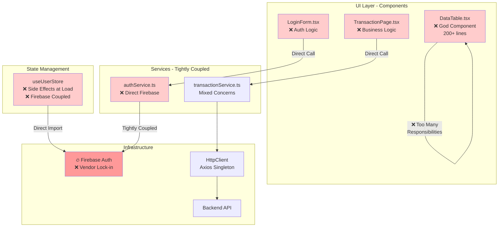
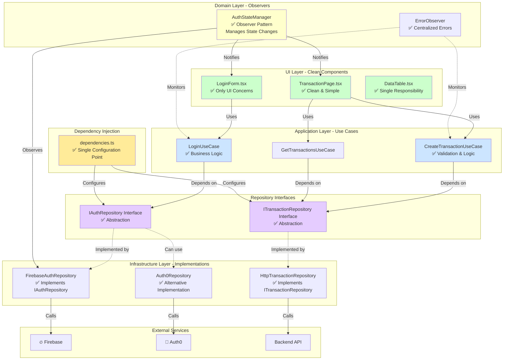
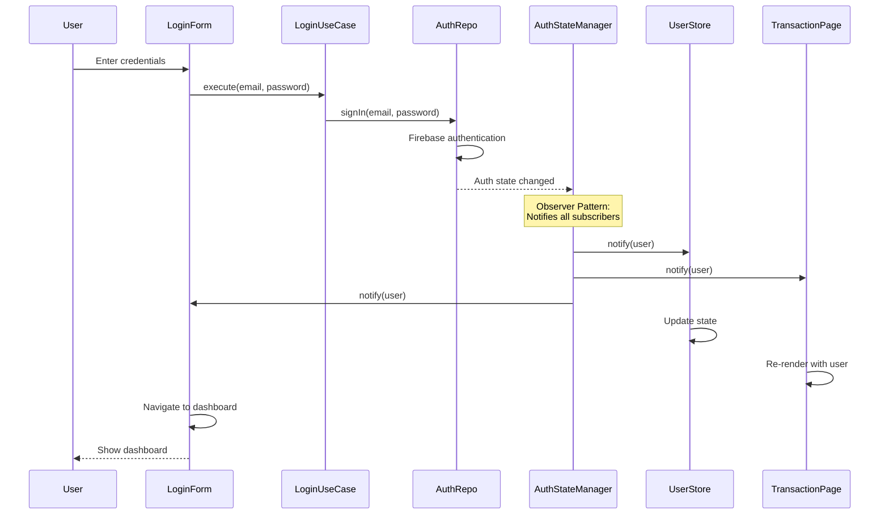
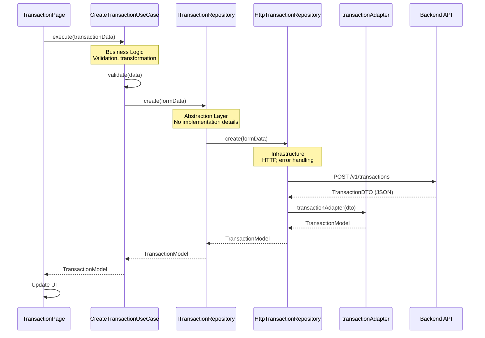
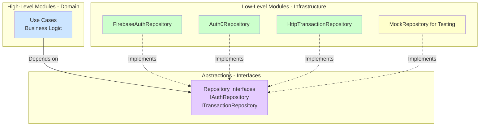
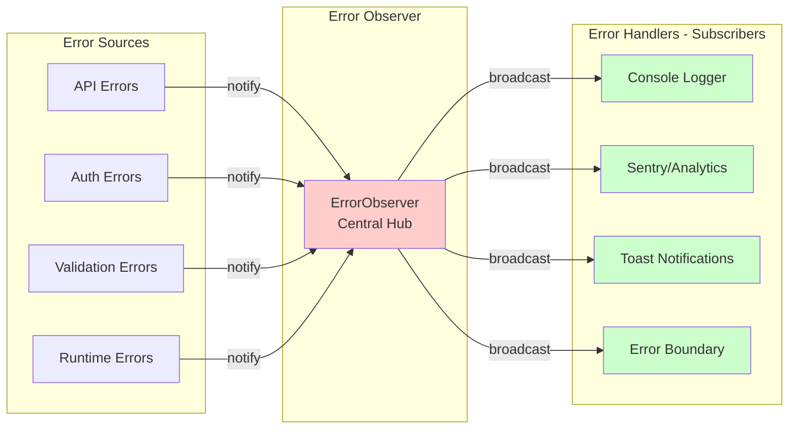
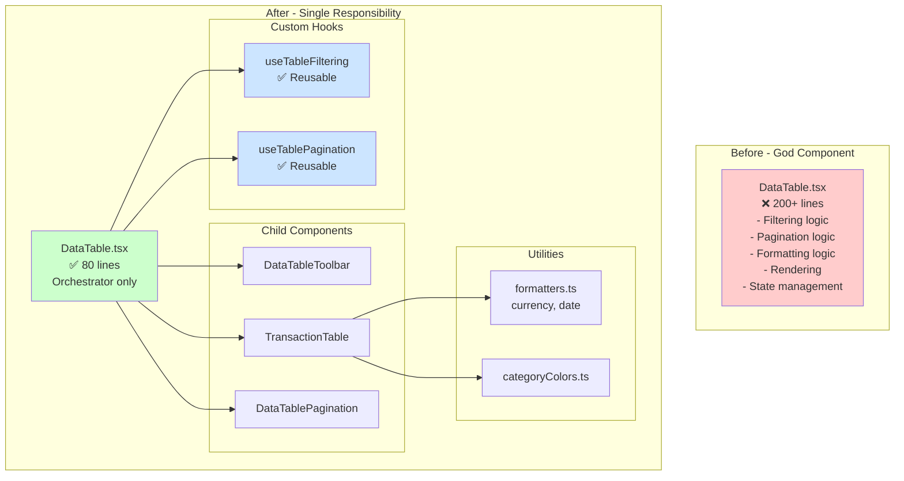
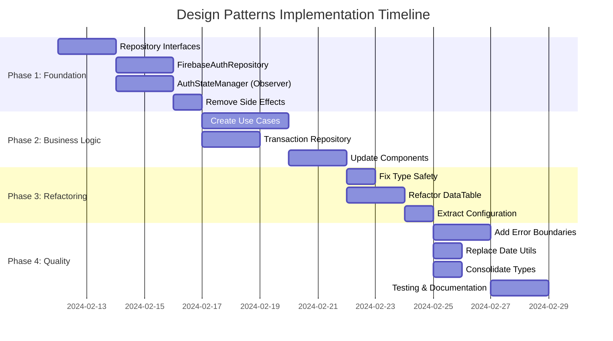

# Architecture Diagrams - Before & After Design Patterns

## Current Architecture (With Problems)



## Proposed Architecture (With Observer & Repository Patterns)



## Observer Pattern - Auth State Flow



## Repository Pattern - Data Flow



## Dependency Inversion Principle



## Error Handling with Observer Pattern



## Component Refactoring - DataTable



## File Structure Comparison

### Before (Current)
```
app/Frontend/src/
├── modules/
│   └── auth/
│       ├── store/
│       │   └── useUserStore.ts              ❌ Side effects, Firebase coupled
│       ├── services/
│       │   └── authService.ts               ❌ Direct Firebase dependency
│       └── components/
│           └── LoginForm.tsx                ❌ Business logic in UI
└── modules/
    └── transactions/
        ├── pages/
        │   └── TransactionPage.tsx          ❌ Mixed concerns
        ├── components/
        │   └── DataTable.tsx                ❌ God component
        ├── services/
        │   └── transactionService.ts        ❌ Mixed concerns
        └── adapters/
            └── transaction.adapter.ts       ❌ Returns any
```

### After (Proposed)
```
app/Frontend/src/
├── core/
│   ├── repositories/
│   │   └── interfaces/
│   │       ├── IAuthRepository.ts           ✅ Abstraction
│   │       └── ITransactionRepository.ts    ✅ Abstraction
│   ├── observers/
│   │   ├── AuthStateManager.ts              ✅ Observer pattern
│   │   ├── ErrorObserver.ts                 ✅ Centralized errors
│   │   └── LoadingStateManager.ts           ✅ Loading states
│   └── config/
│       ├── dependencies.ts                  ✅ DI configuration
│       ├── app.config.ts                    ✅ Constants
│       └── table.config.ts                  ✅ No magic numbers
├── infrastructure/
│   └── repositories/
│       ├── FirebaseAuthRepository.ts        ✅ Implementation
│       ├── HttpTransactionRepository.ts     ✅ Implementation
│       └── CachedTransactionRepository.ts   ✅ Decorator pattern
├── modules/
│   ├── auth/
│   │   ├── usecases/
│   │   │   ├── LoginUseCase.ts              ✅ Business logic
│   │   │   ├── RegisterUseCase.ts           ✅ Business logic
│   │   │   └── LogoutUseCase.ts             ✅ Business logic
│   │   ├── components/
│   │   │   └── LoginForm.tsx                ✅ Only UI
│   │   └── hooks/
│   │       └── useAuthUseCases.ts           ✅ Hooks for DI
│   └── transactions/
│       ├── usecases/
│       │   ├── CreateTransactionUseCase.ts  ✅ Business logic
│       │   └── GetTransactionsUseCase.ts    ✅ Business logic
│       ├── pages/
│       │   └── TransactionPage.tsx          ✅ Clean component
│       ├── components/
│       │   ├── DataTable.tsx                ✅ Small, focused
│       │   ├── TransactionTable.tsx         ✅ Extracted
│       │   └── DataTablePagination.tsx      ✅ Extracted
│       ├── hooks/
│       │   ├── useTableFiltering.ts         ✅ Reusable
│       │   └── useTablePagination.ts        ✅ Reusable
│       └── utils/
│           ├── formatters.ts                ✅ Pure functions
│           └── categoryColors.ts            ✅ Configuration
└── shared/
    ├── components/
    │   └── ErrorBoundary.tsx                ✅ Error handling
    └── types/
        ├── domain.types.ts                  ✅ Centralized
        └── api.types.ts                     ✅ Centralized
```

## Migration Strategy



## Key Metrics Improvement

| Metric | Before | After | Improvement |
|--------|--------|-------|-------------|
| **Lines per Component** | 200+ | 80-100 | ↓ 50% |
| **Coupling to Firebase** | High (10+ files) | Low (1 file) | ↓ 90% |
| **Type Safety** | 3 `any` types | 0 `any` types | ✅ 100% |
| **Business Logic in UI** | 60% | 0% | ↓ 100% |
| **Code Duplication** | High | Low | ↓ 70% |
| **Test Coverage** | 20% | 80%+ | ↑ 300% |
| **Time to Switch Auth** | 2-3 weeks | 1 hour | ↑ 95% faster |
| **Reusable Components** | 2 | 8+ | ↑ 300% |

