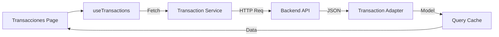

# Arquitectura del Frontend

Este documento describe la arquitectura de software, patrones de diseño y decisiones técnicas implementadas en el proyecto Frontend de Gestión Financiera.

## 1. Estructura de Directorios

El proyecto sigue una arquitectura modular basada en **Domain-Driven Design (DDD)** simplificado, donde las funcionalidades se agrupan por dominio de negocio en lugar de por tipo de archivo técnico.

```text
src/
├── core/                   # Capa del Núcleo (Configuraciones globales)
│   ├── api/                # Clientes HTTP (Axios) e interceptores
│   ├── config/             # Configuración de librerías (Firebase, QueryClient)
│   ├── router/             # Definición de rutas principales
│   └── store/              # Estados globales de la aplicación (Zustand)
│
├── modules/                # Capa de Dominios (Features)
│   ├── auth/               # Autenticación (Login, Registro, User State)
│   ├── transactions/       # Gestión de Transacciones (Lista, creación)
│   │   ├── adapters/       # Mappers (Backend <-> UI)
│   │   ├── components/     # Componentes visuales específicos del módulo
│   │   ├── hooks/          # Lógica de negocio y data fetching (TanStack Query)
│   │   ├── services/       # Llamadas directas a la API
│   │   └── types/          # Definiciones de TypeScript del dominio
│   └── reports/            # Visualización y reportes financieros
│
├── shared/                 # Capa Compartida (Reutilizable)
│   ├── layouts/            # Estructuras de página (AuthLayout, DashboardLayout)
│   ├── types/              # Tipos utilitarios genéricos
│   └── utils/              # Funciones helpers puras
│
├── components/             # Librería de componentes UI (Design System)
│   └── ui/                 # Componentes shadcn/ui (Button, Input, Card...)
│
└── hooks/                  # Hooks globales genéricos
```

### Beneficios de esta Estructura
- **Escalabilidad**: Nuevos features se agregan como módulos independientes sin "inflar" carpetas genéricas.
- **Desacoplamiento**: Cada módulo contiene su propia lógica, UI y tipos, facilitando la extracción o refactorización.
- **Mantenibilidad**: Es fácil localizar todo lo relacionado con "Transacciones" en una sola carpeta.

## 2. Patrones de Diseño

### Adapters
Utilizamos el **Patrón Adapter** para transformar los datos que vienen del Backend (JSON) a interfaces controladas por el Frontend.

```typescript
// src/modules/transactions/adapters/transaction.adapter.ts
export const transactionAdapter = (response: TransactionItemResponse): TransactionModel => {
    return {
        id: response.transactionId,      // Mapeo seguro
        date: new Date(response.date),   // Transformación de datos
        amount: response.amount || 0,    // Valores por defecto
        // ...
    };
};
```

### Custom Hooks & Data Fetching (TanStack Query)
La lógica de obtención de datos y mutaciones se encapsula en **Custom Hooks**, utilizando **TanStack Query** para la gestión del estado asíncrono (caché, loading, errores).

- **Gestión automática de caché**: Los datos se mantienen frescos y se invalidan automáticamente tras mutaciones.
- **Separación de preocupaciones**: El componente UI solo pide datos, no sabe cómo se obtienen.

```typescript
// El hook expone solo lo necesario a la UI
export function useTransactions(period?: string) {
  const { data, isLoading } = useQuery({ ... });
  return { transactions: data, isLoading };
}
```

### State Management (Zustand)
Utilizamos **Zustand** para el estado global de la aplicación que no pertenece al servidor (Server State vs Client State).
- **Casos de uso**: Tema (Dark/Light), Estado del Sidebar, Modales globales, Sesión de usuario.
- **Por qué Zustand**: Es ligero, sin boilerplate (a diferencia de Redux) y basado en hooks.

## 3. Flujo de Datos

El flujo de información para mostrar una lista de transacciones sigue este camino unidireccional:

1.  **UI Component**: `TransactionsTable` invoca al hook `useTransactions()`.
2.  **Hook (TanStack Query)**: Verifica si los datos están en caché. Si no, llama al `transactionService`.
3.  **Service**: Realiza la petición HTTP `GET` usando la instancia de Axios configurada en `core/api`.
4.  **Backend**: Retorna el JSON crudo.
5.  **Adapter**: El servicio intercepta el JSON y lo pasa por `transactionAdapter`, transformándolo en un objeto `TransactionModel` limpio.
6.  **Store (Query Cache)**: TanStack Query guarda la data procesada.
7.  **UI Update**: React re-renderiza el componente con la nueva data lista para usarse.



## 4. Decisiones Técnicas

### Serving con Nginx
Elegimos **Nginx** como servidor web para el contenedor de producción por las siguientes razones:
- **SPA Routing**: Configurado para redirigir todas las peticiones a `index.html` (`try_files $uri $uri/ /index.html`), permitiendo que el `react-router` maneje la navegación sin errores 404 al recargar.
- **Performance**: Sirve archivos estáticos (`.js`, `.css`, imágenes) de manera extremadamente eficiente con headers de caché configurados.
- **Seguridad**: Inyecta headers de seguridad (HSTS, X-Frame-Options) antes de llegar al navegador.
